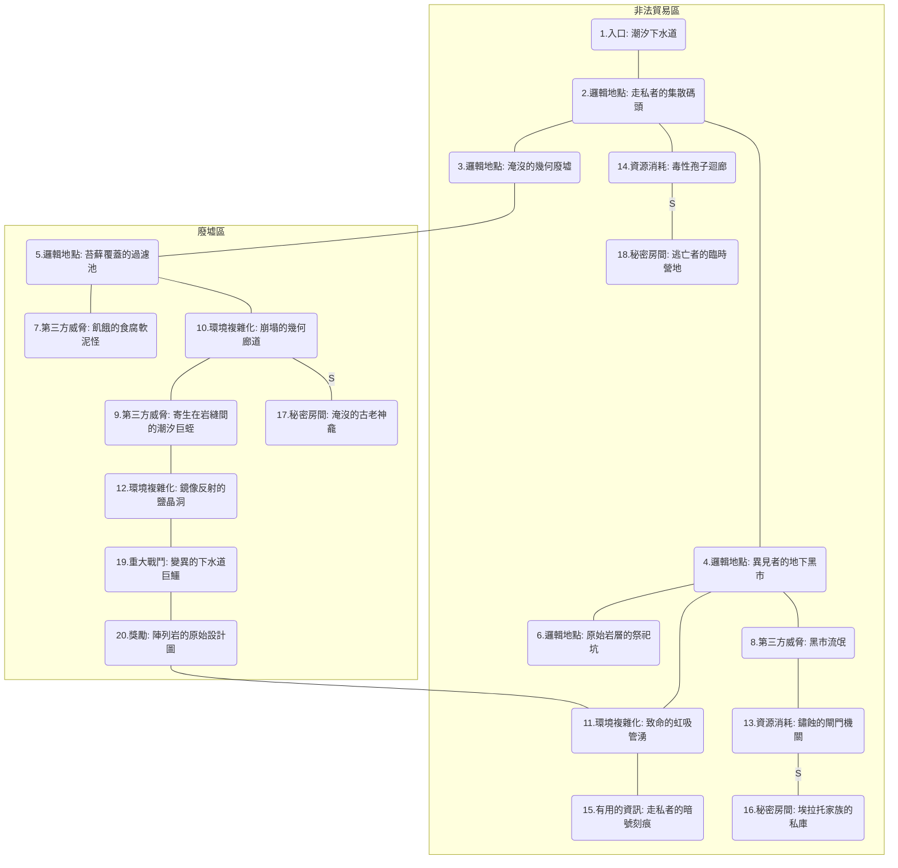

# 陣列岩的地下迷宮

## 簡述
這是一處隱藏在陣列岩（The Alignments）完美幾何結構之下的混亂空間。當潮汐退去，顯露出的不僅是排水系統，還有這座由天然海蝕洞與人工擴建而成的錯綜複雜迷宮。這裡與地表上那種極致的秩序感截然不同，充滿了濕滑的苔蘚、不規則的岩層斷裂以及走私者留下的秘密標記。

迷宮的結構深受潮汐影響，部分區域在漲潮時會被完全淹沒，形成致命的水下陷阱。這裡不僅是流浪者與罪犯的避難所，據傳還隱藏著陣列岩建立前的原始遺跡，以及那些試圖逃離「幾何律法」束縛的異見者所建立的地下黑市。

## 地圖

## 房間

### 1.入口: 潮汐下水道

### 2.邏輯地點: 走私者的集散碼頭

### 3.邏輯地點: 淹沒的幾何廢墟

### 4.邏輯地點: 異見者的地下黑市

### 5.邏輯地點: 苔蘚覆蓋的過濾池

### 6.邏輯地點: 原始岩層的祭祀坑

### 7.第三方威脅: 飢餓的食腐軟泥怪

### 8.第三方威脅: 黑市流氓

### 9.第三方威脅: 寄生在岩縫間的潮汐巨蛭

### 10.環境複雜化: 崩塌的幾何廊道

### 11.環境複雜化: 致命的虹吸管湧

### 12.環境複雜化: 鏡像反射的鹽晶洞

### 13.資源消耗: 鏽蝕的閘門機關

### 14.資源消耗: 毒性孢子迴廊

### 15.有用的資訊: 走私者的暗號刻痕

### 16.秘密房間: 埃拉托家族的私庫

### 17.秘密房間: 淹沒的古老神龕

### 18.秘密房間: 逃亡者的臨時營地

### 19.重大戰鬥: 變異的下水道巨鱷

### 20.獎勵: 陣列岩的原始設計圖

