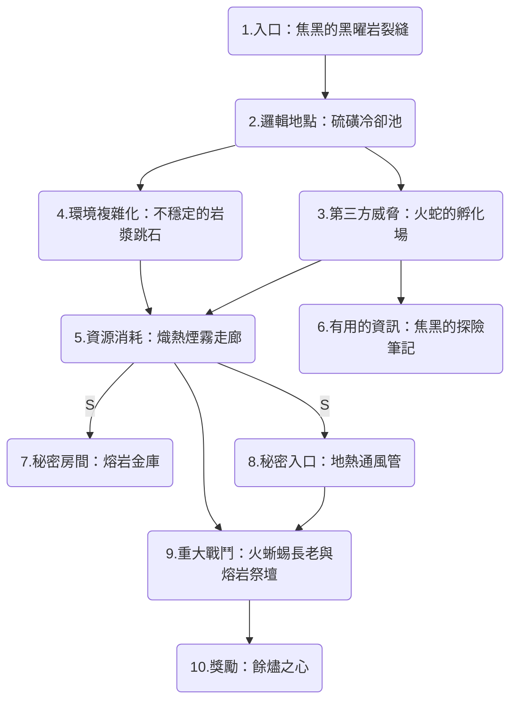

# 紅流外的火龍巢穴

## 簡述
這是一個位於紅流城鎮郊外、地熱活動極為劇烈的天然熔岩洞窟。此處曾是一條古老巨龍的棲息地，雖然巨龍早已離去，但殘留的龍息能量與高溫環境吸引了一群火蜥蜴與熔岩元素在此盤踞。洞穴內部充斥著致命的硫磺煙霧與緩慢流動的岩漿河。

## 地圖

## 房間

### 1.入口：焦黑的黑曜岩裂縫
洞口隱藏在紅流郊外的亂石崗中，邊緣因長期高溫而呈現玻璃化的黑曜岩質感。

- **障礙**： 洞口不斷噴出灼熱的蒸汽。角色需通過敏捷檢定以避開間歇噴發的熱氣，否則將受到輕微火傷。
- **暗示**： 地面上散落著融化一半的冒險者盔甲，以及被高溫烤焦的巨大爪印，暗示內部生物對熱能的極高耐性。

### 2.邏輯地點：硫磺冷卻池
這裡曾是巨龍飲水的地方，現在則充滿了半凝固的硫磺與礦物質。

- **環境**： 空氣中瀰漫著濃厚的黃色煙霧，能見度極低。幾隻火蜥蜴正在此處翻動礦石，尋找可食用的熱能結晶。
- **細節**： 牆壁上掛著由耐熱金屬打造的簡陋工具，顯示這裡的生物具有一定的智力與組織性。

### 3.第三方威脅：火蛇的孵化場
這是一個溫度極高的圓形洞穴，地面佈滿了如紅寶石般半透明的火蛇卵。

- **地型**： 地面極度燙手，非耐熱靴子在此處停留過久會受損。
- **威脅**： 這裡棲息著 4-6 隻火蛇 (Fire Snakes)。牠們極具攻擊性，會瘋狂保護孵化中的卵。若戰鬥聲音過大，可能會引來相鄰房間的注意。

### 4.環境複雜化：不穩定的岩漿跳石
一條寬闊的岩漿河橫切過洞穴，唯一的通路是幾塊漂浮在岩漿上的黑曜岩殘骸。

- **障礙**： 角色需要進行一系列的運動或體操檢定來跳躍。
- **動態**： 這些跳石並不穩定，每當生物站上去後，石頭會緩慢下沉。若在同一塊石頭停留超過 2 回合，石頭將完全沒入岩漿。

### 5.資源消耗：熔熱煙霧走廊
這是一段極長且狹窄的隧道，兩側牆壁不斷滲出滾燙的岩漿，使空氣變得極度稀薄且灼熱。

- **威脅**： 走廊內充滿了致命的硫磺毒氣與高溫。
- **代價**： 角色每在走廊內停留 1 分鐘，就必須進行一次體質豁免，否則將獲得一級力竭或受到火傷。角色可能需要消耗抗火藥劑、護盾術或德魯伊的「造風術」來稀釋煙霧以安全通過。

### 6.有用的資訊：焦黑的探險筆記
在火蛇孵化場的岩縫中，卡著一具半碳化的骸骨，其懷中護著一本金屬封面的筆記。

- **線索**： 筆記由一位紅流的鍊金術師所寫，記錄了火蜥蜴長老的戰鬥習慣，並提到長老極度依賴祭壇提供的熱能護盾。
- **弱點**： 筆記中標註了祭壇的三個關鍵節點，若能同時破壞這些節點，長老的防禦將會瓦解，且會受到嚴重的寒冷傷害加成。

### 7.秘密房間：熔岩金庫
隱藏在煙霧走廊盡頭的一處幻術牆壁後（需要通過高難度的察覺或調查檢定）。

- **獎勵**： 這裡存放著古龍遺留的一小部分財寶，包括一柄「餘燼長劍」（攻擊附帶火傷）或一對「黑曜岩護腕」（增加火屬性抗性）。

### 8.秘密入口：地熱通風管
在冷卻池的上方有一個隱蔽的垂直通風口，直通地表。

- **功能**： 擅長攀爬或擁有飛行能力的生物可以從此處直接降落到 Boss 房間的橫樑上，避開中間所有的陷阱與小怪，發動致命的空襲。

### 9.重大戰鬥：火蜥蜴長老與熔岩祭壇
這是洞穴最深處的巨大熔岩湖心，中央有一座由黑曜岩砌成的祭壇，正不斷從地脈抽取純淨的火元素能量。

- **核心**： 火蜥蜴長老 (Salamander Noble) 守護著祭壇，身邊環繞著 2 隻熔岩元素 (Magma Mephits)。
- **機制**： 祭壇每回合會為長老提供一層「熔岩護甲」（提供臨時生命值並對近戰攻擊者造成反震火傷）。角色必須分配行動力去破壞祭壇的三個能量節點，否則長老將近乎無敵。

### 10.獎勵：餘燼之心
戰鬥結束後，祭壇崩塌，核心處顯露出一顆跳動著火光的晶體。

- **物品**： 「餘燼之心」（強大的奇物，可提升火系法術威力，或作為紅流地熱鍛造場的終極燃料）。
- **劇情**： 在祭壇下方發現了一條通往更深處地底世界的隧道，牆上刻有與「瑪格瑪家族」相關的古老家徽，暗示著城鎮勢力與此處的秘密聯繫。