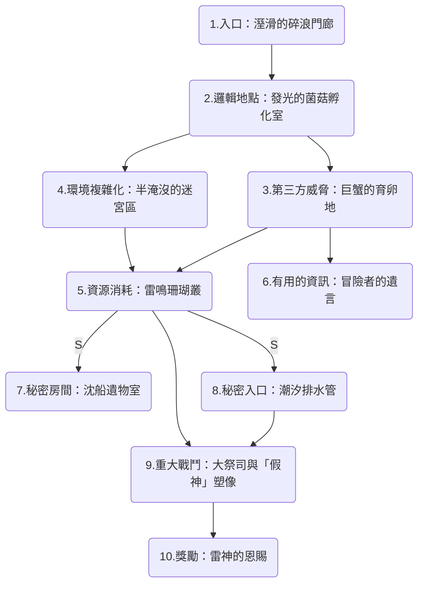

---
tags:
  - 海蝕洞
  - 地下城
  - 小型地下城
  - dungeon
  - small dungeon
---
# 海蝕洞

## 簡述
這是一個天然形成的海蝕洞，目前被寇濤魚人(Kuo-toa)佔據。它的入口位於沙灘的角落，在退潮時可以輕易發現。

## 地圖

## 房間

### 1.入口：溼滑的碎浪門廊
洞口佈滿了鋒利的藤壺與滑膩的綠藻。

- **障礙**： 漲潮時，海水會劇烈拍打入口。角色需通過力量檢定才不會被浪花捲入海中受傷。
- **暗示**： 門口立著一根由魚骨與海草綑綁成的圖騰，上面掛著腐爛的魚頭，暗示這裡有某種原始且瘋狂的宗教崇拜。

### 2.邏輯地點：發光的菌菇孵化室
寇濤人生活與育兒的地方。

- **環境**： 牆上生長著螢光苔蘚，照亮了數以千計包裹在黏液裡的魚卵。幾隻寇濤人正在用腐爛的海洋生物屍體「餵食」這些卵。
- **細節**： 這裡充滿了刺鼻的魚腥味，角色可以看到他們簡陋的石床和用船隻殘骸製成的儲物箱。

### 3.第三方威脅：巨蟹的育卵地
這是一個充滿潮汐池與細沙的寬闊洞穴，空氣中瀰漫著鹹腥味與甲殼磨擦的聲音。一群巨蟹 (Giant Crabs) 在此定居。寇濤人視這些螃蟹為「聖獸」，但螃蟹本身對魚人完全沒有忠誠度，牠們只守護自己的領地與蟹卵。

- **地型**： 地面散佈著滑膩的岩石與淺水坑。
- **威脅**： 這裡棲息著 3-5 隻巨蟹。牠們處於中立敵對狀態，會攻擊任何進入其感官範圍（盲視 30 呎）且發出巨大動靜的生物。

### 4.環境複雜化：半淹沒的迷宮區
這是一個隨潮汐變化的區域。

- **障礙**： 房間內水位及腰（困難地形），且水中隱藏著數個深不見底的海溝陷阱。
- **動態**： 戰鬥中每過 3 回合，水位會升高或降低。水位高時，寇濤人擁有游泳優勢；水位低時，隱藏的淤泥會讓角色移動速度減半。

### 5.資源消耗：雷鳴珊瑚叢
寇濤人培育了一種具有魔力的藍色珊瑚作為防禦手段。

- **威脅**： 只要有劇烈動作或大聲說話，珊瑚就會釋放震波。
- **代價**： 角色可能需要消耗低階法術（如靜音術）或進行多次體質豁免 以避免被震懾或造成雷鳴傷害。

### 6.有用的資訊：冒險者的遺言
在巨蟹育卵地的角落，角色可以發現一具被啃食乾淨的冒險者骸骨。

- **線索**： 骸骨手中緊握著一本防水的航海日誌，記載了大祭司正在舉行一場「造神儀式」，並提到大祭司的法力來源於那座拼湊而成的塑像。
- **弱點**： 日誌中提到，塑像的結構並不穩固，若能使用強力的衝擊或火焰攻擊其基座，可能會導致其崩塌。

### 7.秘密房間：沈船遺物室
藏在一個看似死路的珊瑚牆後（需要察覺發現暗門）。

- **獎勵**： 這裡堆放著多年來沈船落入海中的財寶，包含一柄 +1 魚叉 或一件能讓穿戴者在水下呼吸的 海草披風。

### 8.秘密入口：潮汐排水管
在孵化室的底部有一個狹窄的水道，原本是用來排出多餘海水的。

- **功能**： 小型體型的生物（或使用變身術的角色）可以透過這條充滿黏液的水道直接繞過「資源消耗」區，直達 Boss 房間的後方，進行奇襲。

### 9.重大戰鬥：大祭司與「假神」塑像
這是洞穴最深處的巨大石室，中央矗立著一個由廢鐵、木頭和骨頭拼湊而成的巨大海怪塑像。

- **核心**： 寇濤大祭司 (Kuo-toa Archpriest) 帶領信徒瘋狂祈禱。
- **機制**： 由於寇濤人的集體意識，這個「塑像」竟然真的動了起來（使用大型土元素或血肉魔像的數據，但帶有水系傷害）。

### 10.獎勵：雷神的恩賜
戰鬥結束後，假神塑像崩塌，露出其內部的核心。

- **物品**： 一顆「風暴珍珠」（可用來施展一次召喚閃電或控制天氣）。
- **劇情**： 角色還會發現一張海圖，上面標示了另一個更深的海底都市位置，開啟下一段冒險。