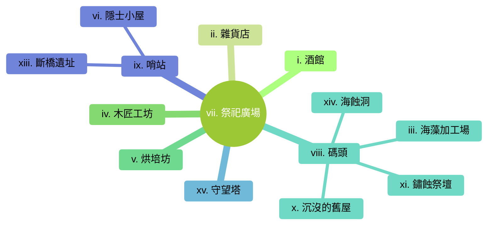

---
tags:
  - 藻林村
  - 小村莊
  - hamlet
---
## I. 簡介

藻林村坐落於森林與海岸的交界處，這是一個以採集與加工海藻為生的寧靜聚落。村莊被高大且潮濕的原始森林包圍，另一側則是佈滿礁石與海帶床的淺灘。這裡的空氣中總是瀰漫著淡淡的鹹味與木材燃燒的煙霧。由於地理位置偏遠，藻林村保留了許多古老的傳統與對海洋的敬畏，村民們過著自給自足的生活，與外界的聯繫僅靠著幾條隱密的山徑與不定期停靠的小型貨船。儘管表面平靜，但森林深處的陰影與海蝕洞中的低語，暗示著這片土地隱藏著不為人知的古老秘密。

## II. 地點

### i. 酒館
這家名為「鹹海藻酒館」的小店是村內唯一的社交中心。建築由廢棄船材搭建而成，室內光線昏暗，空氣中混雜著廉價麥酒與乾燥海藻的氣味。

#### 內部環境
這座酒館的內部空間狹窄且低矮，天花板由幾塊巨大的龍骨殘骸支撐，上面掛滿了乾燥的海藻與幾盞搖晃的防風油燈。牆壁上裝飾著鏽蝕的魚鉤與褪色的航海圖，地板則是粗糙的木板，走上去會發出吱呀聲。儘管環境潮濕，但中央的石砌壁爐始終燃著微弱的火光，為這座偏遠的村落提供了一處溫暖的避風港。

#### NPCs

| 名稱 | 性別 | 年齡 | 種族 | 身分 | 外貌特徵 | 性格與特質 | 備註 |
| --- | --- | --- | --- | --- | --- | --- | --- |
| **奧德 (Olde)** | 男性 | 58歲 | 人類 | 酒館老闆 | 滿臉鬍渣，缺了一隻左耳 | 豪爽但對海況極其敏感 | 前水手 |

#### 招牌菜
| 菜名 | 價格 | 描述 |
| --- | --- | --- |
| **藤壺燉菜** | 5 CP | 用當日採集的藤壺與海草熬煮，味道極鹹。 |
| **發光菌菇湯** | 8 CP | 使用海蝕洞採集的發光菌類，湯頭呈現幽藍色。 |
| **陳年海藻酒** | 3 CP | 帶有強烈魚腥味與鹹味的烈酒，後勁十足。 |
| **烤海鰻串** | 6 CP | 抹上特製海藻醬汁火烤，肉質肥美。 |

### ii. 雜貨店
提供基本的採集工具、食鹽與耐放的乾糧。店內雜亂地堆放著漁網與麻繩，是村民交換情報的非正式場所。

#### 內部環境
這間店鋪內部空間侷促，天花板低矮且掛滿了乾燥的魚乾與一捆捆粗糙的麻繩。空氣中瀰漫著濃郁的鹹魚味、乾海藻的土腥氣與淡淡的防腐魚油味。貨架由粗糙的漂流木板搭建，上面雜亂地擺放著生鏽的鐵釘、裝滿食鹽的陶罐以及用防水布包裹的乾糧。櫃檯後方的小窗戶常年被海鹽結晶覆蓋，使得室內光線昏暗，只有一盞搖曳的油燈映照著瑪莎忙碌的身影。

#### NPCs

| 名稱 | 性別 | 年齡 | 種族 | 身分 | 外貌特徵 | 性格與特質 | 備註 |
| --- | --- | --- | --- | --- | --- | --- | --- |
| **瑪莎 (Martha)** | 女性 | 42歲 | 人類 | 雜貨店主 | 總是裹著厚重的羊毛披肩 | 碎嘴、熱情，喜歡打聽八卦 | 消息靈通 |

#### 商品
| 商品 | 價格 | 描述 |
| --- | --- | --- |
| **冒險用具** | 2 CP | 包含繩索、火炬、空瓶等基礎物資。 |
| **採集工具** | 5 CP | 鐮刀、防水背簍與防滑靴。 |
| **防潮斗篷** | 1 SP | 塗有魚油的厚重帆布斗篷，極佳的防水性能。 |
| **發光菌粉** | 15 CP | 撒在物體表面可發出微弱綠光，持續約 1 小時。 |

### iii. 海藻加工場
村中最大的建築，設有大型的煮沸鍋爐與露天曬架。這裡負責將採集來的海藻分類、清洗並烘乾，製成可外銷的乾貨或肥料。

#### 內部環境
這座寬敞的建築內部充滿了濃郁的煮沸海藻味與潮濕的蒸汽。巨大的石製鍋爐整齊排列，下方燃燒著由漂流木維持的微火，發出低沉的咕嘟聲。天花板橫樑上懸掛著無數垂下的濕潤海藻，像是一片室內的深色森林，水滴不斷落在石板地面上，匯聚成流向室外排水溝的小徑。建築後方連接著一片露天的木製曬架區，成千上萬片海藻在海風中拍打，發出如紙張摩擦般的沙沙聲。

#### NPCs

| 名稱 | 性別 | 年齡 | 種族 | 身分 | 外貌特徵 | 性格與特質 | 備註 |
| --- | --- | --- | --- | --- | --- | --- | --- |
| **巴恩 (Barn)** | 男性 | 35歲 | 半身人 | 加工場領班 | 皮膚黝黑，手臂肌肉發達 | 嚴謹、效率至上 | 游泳高手 |

### iv. 木匠工坊
由一位沉默寡言的老木匠經營，主要負責維修漁船與製作加工海藻所需的木架。工坊後方堆放著許多被海水浸泡過的漂流木。

#### 內部環境
這間工坊充滿了乾燥木屑與鹹濕海水的混合氣味。室內空間被巨大的漂流木料佔據，牆上整齊地掛著各式各樣的木工工具：從鏽跡斑斑的長鋸到磨得發亮的鑿刀。地板上鋪著厚厚一層刨花，踩上去發出輕微的沙沙聲。角落裡擺放著幾具尚未完工的船隻龍骨架，在昏暗的油燈下，木材表面的天然紋路宛如扭曲的深海生物。

#### NPCs
| 名稱 | 性別 | 年齡 | 種族 | 身分 | 外貌特徵 | 性格與特質 | 備註 |
| --- | --- | --- | --- | --- | --- | --- | --- |
| **塞拉斯 (Silas)** | 男性 | 65歲 | 半精靈 | 木匠 | 手指粗糙，眼神深邃 | 孤僻、專注於工作 | 沉默寡言 |

### v. 烘培坊
每日限量供應摻有海藻粉的粗麥麵包。這種麵包雖然色澤偏綠且帶有鹹味，卻是村民體力的主要來源。

#### 內部環境
這間烘培坊充滿了溫暖的麥香與海藻特有的微鹹氣息。室內中央是一座巨大的圓形石窯，窯口透出橘紅色的火光，映照著牆上掛滿的各種木製麵包鏟。空氣中飄浮著細微的麵粉顆粒，在陽光照射下閃閃發亮。長條形的木桌上擺滿了剛出爐、呈現深綠色的海藻麵包，表面撒著粗鹽結晶，散發著誘人的熱氣。角落裡堆放著幾袋來自長灣的優質麵粉與一桶桶浸泡中的發光菌液，顯示出店主對食材研發的熱忱。

#### NPCs
| 名稱 | 性別 | 年齡 | 種族 | 身分 | 外貌特徵 | 性格與特質 | 備註 |
| --- | --- | --- | --- | --- | --- | --- | --- |
| **艾琳 (Eryn)** | 女性 | 26歲 | 矮人 | 烘焙師 | 臉上總帶著麵粉，編著粗辮子 | 樂觀、富有實驗精神 | 研發海藻食譜 |

### vi. 隱士小屋
位於村莊邊緣、森林入口處的破舊小屋。住著一位自稱能聽見森林低語的老婦人，村民對她既敬畏又疏遠。

#### 內部環境
這座小屋內部空間極其狹窄，牆壁由扭曲的樹根與佈滿藤壺的漂流木交織而成。空氣中瀰漫著一股濃烈的乾燥草藥、腐爛海藻與陳舊骨頭的奇異氣味。天花板上懸掛著無數由魚線串起的動物頭骨、乾癟的魚眼與刻有符文的木片，在微風中發出清脆的撞擊聲。室內沒有正式的家具，只有一堆鋪著獸皮的乾草堆作為床鋪，以及一個終年冒著綠色煙霧的小石爐，爐上正燉煮著成分不明的黏稠液體。牆角堆滿了裝有各色液體的玻璃瓶，其中一些在黑暗中閃爍著不安的微光。

#### NPCs
| 名稱 | 性別 | 年齡 | 種族 | 身分 | 外貌特徵 | 性格與特質 | 備註 |
| --- | --- | --- | --- | --- | --- | --- | --- |
| **莫嘉娜 (Morgana)** | 女性 | 72歲 | 人類 | 隱士 | 披頭散髮，掛著骨製飾品 | 神經質、說話充滿隱喻 | 森林占卜師 |

### vii. 祭祀廣場
位於村中心的圓形空地，中央有一根刻滿海浪紋路的石柱。每逢潮汐大祭，村民會在此舉行祈求平安的儀式。

### viii. 碼頭
由粗糙的石塊與腐朽的木板延伸至海中。由於吃水較淺，僅能停靠平底小船，是與外界貿易的唯一窗口。

#### NPCs
| 名稱 | 性別 | 年齡 | 種族 | 身分 | 外貌特徵 | 性格與特質 | 備註 |
| --- | --- | --- | --- | --- | --- | --- | --- |
| **托馬斯 (Thomas)** | 男性 | 30歲 | 人類 | 碼頭工人 | 身材魁梧，背部有海浪刺青 | 踏實、話不多 | 負責裝卸貨物 |

### ix. 哨站
位於進入村莊的山徑旁，是一座簡易的木製平台。通常只有一名民兵駐守，負責監視森林方向的動靜。

#### NPCs
| 名稱 | 性別 | 年齡 | 種族 | 身分 | 外貌特徵 | 性格與特質 | 備註 |
| --- | --- | --- | --- | --- | --- | --- | --- |
| **凱恩 (Kane)** | 男性 | 22歲 | 人類 | 民兵 | 瘦弱，總是緊握著長矛 | 膽小、警覺性高 | 容易緊張 |

### x. 沉沒的舊屋
漲潮時會被海水淹沒一半的廢棄民宅。傳聞在深夜的潮汐聲中，能看見屋內閃爍著幽暗的藍光。

### xi. 鏽蝕祭壇
位於海岸線最偏僻的礁石區，這座祭壇已被海水侵蝕得面目全非。祭壇上刻有古老的海洋符文，據說在特定的月相下，祭壇會散發出冰冷的氣息。

### xii. 墓園
位於村莊後方的小山丘上，墓碑多由海邊磨損的礁石製成，刻有簡單的姓名與生卒年。這裡長年籠罩在海霧之中，顯得格外淒清。

### xiii. 斷橋遺址
原本連接村莊與森林深處的木橋，多年前因一場罕見的風暴而斷裂。殘餘的橋墩上長滿了濕滑的苔蘚，成為孩子們冒險的禁地。

### xiv. 海蝕洞
位於碼頭北側的巨大岩洞，退潮時可以進入。洞壁上掛滿了發光的菌類，村民傳說洞穴深處通往大海的心臟。

### xv. 守望塔
村中最高的建築，是一座由石塊與巨木搭建的簡易塔樓。用於監視海面上的船隻與森林中的野獸，塔頂備有警示用的火炬。

#### NPCs
| 名稱 | 性別 | 年齡 | 種族 | 身分 | 外貌特徵 | 性格與特質 | 備註 |
| --- | --- | --- | --- | --- | --- | --- | --- |
| **里歐 (Leo)** | 男性 | 19歲 | 人類 | 守望員 | 戴著單邊護目鏡，身手矯健 | 好奇心強、熱愛觀察 | 視力極佳 |

## III. 有趣的事實
- **發光的麵包**：烘焙師艾琳研發出一種加入特定比例發光菌粉的麵包，雖然吃完後舌頭會發綠光持續一整晚，但據說能讓人看清海霧中的路徑。
- **海藻氣象預報**：村長老們能透過觀察加工場曬架上特定海藻的捲曲程度與顏色變化，準確預測未來三天的風浪大小，準確率比專業的航海士還高。
- **漂流木的詛咒**：木匠塞拉斯從不使用帶有紅色條紋的漂流木製作家具，他堅稱那些木材寄宿著溺水者的靈魂，會在深夜發出抓撓聲。
- **潮汐的節奏**：祭祀廣場的石柱在極低潮時會發出類似低音號的鳴響，村民認為這是海洋女神在呼吸，實際上是海水穿過石柱下方天然孔洞產生的物理現象。
- **禁忌的森林**：自從斷橋風暴後，村民們達成共識，絕不在日落後靠近森林邊緣，因為據說那裡的樹木會在黑暗中緩慢移動位置。

## IV. 冒險鉤子

### i. 佈告欄

### ii. 傳聞

#### a. 真實的傳聞
- **海蝕洞的發光菌**：這些菌類之所以發光，是因為吸收了洞穴深處古老魔法陣殘留的能量，長期接觸確實會影響生物的生理狀態。
- **斷橋的真相**：十年前的風暴並非自然現象，而是森林深處的某種力量試圖切斷與村莊的聯繫，防止村民進一步深入。
- **海藻氣象預報**：這並非迷信，而是因為該種海藻對大氣壓力與濕度極度敏感，其細胞結構會隨環境變化而產生物理性的扭曲與變色。

#### b. 半真半假的傳聞
- **溺水者的靈魂**：傳聞紅紋漂流木寄宿著靈魂，實際上那是某種寄生在木材纖維中的紅色微型海藻，在深夜會分泌出類似呻吟聲的氣體。
- **海洋女神的呼吸**：石柱的鳴響確實是物理現象，但石柱本身的材質與刻紋確實具有穩定周邊海域波浪的微弱魔法效果。
- **莫嘉娜的預言**：她確實能感知到森林的異動，但她所說的「低語」大多是她因長期吸入發光菌粉而產生的幻聽與真實感知的混合。

#### c. 假的傳聞
- **長灣的債務**：那艘貨船上的商人其實是「三奇公司」的成員偽裝的，他們編造債務只是為了合法地進入村莊搜尋海蝕洞中的寶藏。
- **發光麵包的導航功能**：艾琳的麵包雖然會讓舌頭發光，但那純粹是視覺效果，並不能真的讓人看穿濃霧，反而會讓你在黑暗中變成明顯的目標。
- **沉沒舊屋的寶藏**：屋內閃爍的藍光並非金銀財寶，而是漲潮時被困在屋內的發光水母群。

### iii. 居民請求

## V. 勢力

## VI. 表格

### 基本資訊

| 項目 | 內容 |
| --- | --- |
| **市鎮名稱** | 藻林村 |
| **地理位置** | 海岸與森林交界處 |
| **行政級別** | 村莊 |
| **人口規模** | 約50人 |
| **主要種族** | 人類 (80%)、半身人、矮人 |

### 地理與環境

| 項目 | 內容 |
| --- | --- |
| **地形地貌** | 海蝕礁岩岸、潮濕原始森林 |
| **氣候特徵** | 多霧、潮濕、海風強勁 |
| **周邊資源** | 海藻、漂流木、發光菌類 |
| **交通樞紐** | 僅靠一條隱密山徑與小型簡易碼頭 |

### 政治與經濟

| 項目 | 內容 |
| --- | --- |
| **統治者/組織** | 村民長老會議 (由各工坊領頭組成) |
| **法律與治安** | 傳統習俗約束，由一名民兵駐守 |
| **主要產業** | 海藻採集與加工、漁業 |
| **流通貨幣** | 通用銅幣、以物易物 |
| **進出口貿易** | 出口：乾海藻、肥料；進口：食鹽、鐵器 |

### 文化與生活

| 項目 | 內容 |
| --- | --- |
| **宗教信仰** | 海洋與森林原始崇拜 |
| **風俗習慣** | 每日清晨向大海祈禱，忌諱深夜入林 |
| **特色建築** | 船材造建築、石造祭壇 |
| **飲食文化** | 海藻麵包、鹹魚、海藻酒 |
| **節慶活動** | 潮汐大祭 (祈求平安與豐收) |

### 歷史與現況

| 項目 | 內容 |
| --- | --- |
| **建城歷史** | 約百年前由避難的漁民所建 |
| **重大事件** | 十年前的「斷橋風暴」導致與森林深處斷聯 |
| **當前困境** | 海藻產量下降，森林陰影擴張 |
| **市鎮秘密** | 沉沒舊屋下的古老契約與海蝕洞的低語 |

## 周遭地點