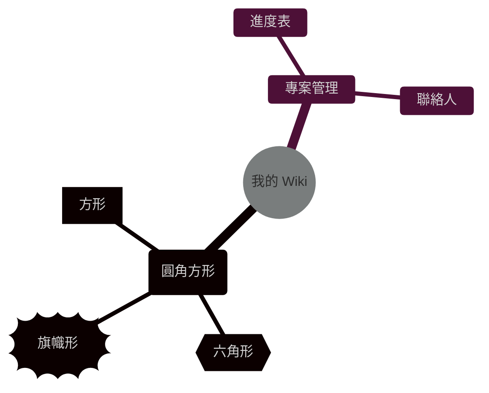

# 首頁

## 測試
???+ note "點擊展開查看詳細地圖描述"
    `???`：預設為摺疊狀態。
    `???+`：預設為展開狀態。
    `note`：區塊的樣式（顏色），你可以換成 info, warning, danger 等。

!!! info "提示"
    首頁順便放一些測試用的東西。

==重要的文字==

~~刪除線~~

=== "標籤A"
    `你好`
=== "標籤B"
    `掰掰`

這段話需要補充說明[^1]。

[^1]: 這是自動生成的腳註內容。

## 徽章測試

**奧德 (Olde)**{: .md-tag-custom .tag-name } **男性**{: .md-tag-custom .tag-gender } **58歲**{: .md-tag-custom .tag-age } **人類**{: .md-tag-custom .tag-race } **酒館老闆**{: .md-tag-custom .tag-identity } **滿臉鬍渣**{: .md-tag-custom .tag-look }、 **配戴方缺了一隻左耳眼鏡**{: .md-tag-custom .tag-look } **豪爽**{: .md-tag-custom .tag-trait }、 **對海況極其敏感**{: .md-tag-custom .tag-trait } **前水手**{: .md-tag-custom .tag-note }

**奧德  (Olde)**{: .md-tag-custom .tag-name }

**奧德  (Olde)**{: .md-tag }

奧德  (Olde)

### LaTeX 測試

\[
\frac{n!}{k!(n-k)!} = \binom{n}{k}
\]

### mermaid 測試
