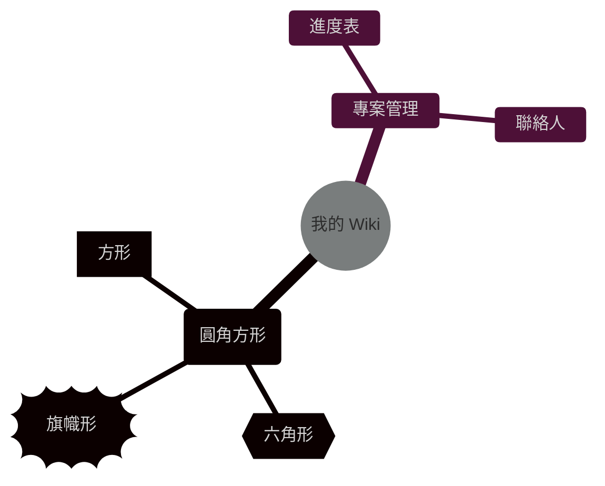

# 首頁

## 測試

!!! info "提示"
    首頁順便放一些測試用的東西。

=== "標籤A"
    `你好`
=== "標籤B"
    `掰掰`

這段話需要補充說明[^1]。

[^1]: 這是自動生成的腳註內容。

### 任務清單

- [x] 完成基礎架構
- [ ] 撰寫 API 文件
- [ ] 上傳圖片資產

### LaTeX
$$ E = mc^2 $$

### mermaid 測試
