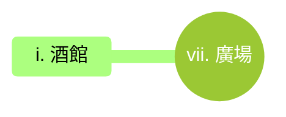

---
tags:
  - 長灣
  - Longish Inlet
  - 首都
  - capital
---
# 長灣 Longish Inlet

## I. 簡介

長灣是這片區域最繁華的政治與經濟中心，坐落於半月形的天然良港之上。這座城市以其宏偉的白色石造建築與錯綜複雜的水路交通聞名。作為貿易樞紐，長灣吸引了來自世界各地的商人、學者與冒險者，街道上終日迴盪著各國語言的交談聲與海浪拍岸的節奏。城市由高聳的城牆守護，內部劃分為富麗堂皇的貴族區、充滿活力的商業港區以及充滿市井氣息的平民區。這裡不僅是權力的核心，也是無數陰謀與傳奇誕生的舞台。

## II. 地點

## II-A. 地點（商業區）

### 市集
長灣最繁忙的貿易地帶，由無數露天攤位與遮陽棚組成。這裡販售從異國香料到精緻絲綢的一切商品，是城市經濟的脈搏。

### 雜貨店
這家店鋪是長灣規模最大的零售點。店內天花板懸掛著各色乾貨與皮革，貨架上整齊排列著來自內陸的穀物與海外的精緻罐裝食品。

### 鐵匠鋪
這座工坊是長灣最負盛名的鍛造地。巨大的煙囪終日排放著熱氣，店內陳列著從精緻的儀仗劍到厚重的騎士板甲等各類軍械。

### 藥劑店
這家店鋪充滿了乾燥草藥與化學藥劑的混合氣味。深色的木製櫃檯後方擺滿了數百個貼有標籤的小瓷瓶，提供從止痛膏到強效解毒劑的各類醫療用品。

### 煉金工坊
這座建築總是傳出低沉的沸騰聲與奇異的彩色煙霧。室內擺滿了複雜的蒸餾器、燒瓶與不斷旋轉的機械裝置，是研究物質轉化與魔法藥劑的尖端實驗室。

### 拍賣行
這座宏偉的圓頂建築是長灣財富的縮影。內部裝潢極其奢華，設有階梯式的觀賽席與防護嚴密的展示台，專門拍賣稀有的藝術品、魔法遺物以及來自遠古遺跡的珍寶。

### 骨董行
店內堆滿了沾滿灰塵的舊物、古代陶器與泛黃的歷史文獻。雖然表面雜亂，但店主宣稱這裡的每一件物品都承載著一段消失的歷史，偶爾能從中淘到具備微弱魔力的真品。

### 魔法商店
這家店鋪的門扉刻有流動的奧法符文，內部空間似乎比外觀看起來更為寬廣。貨架上陳列著閃爍微光的法術捲軸、精緻的魔杖與各類稀有的施法媒介，是施法者們的朝聖之地。

### 酒館
名為「金錨酒館」的熱鬧場所，是商賈與冒險者交換情報的首選。室內迴盪著吟遊詩人的歌聲與酒杯碰撞的清脆聲，提供各國名酒與豐盛的海鮮料理。

### 旅店
這座多層建築提供從簡陋通鋪到貴族套房的各類住宿。頂層房間擁有俯瞰整個長灣港口的絕佳視野，並設有專門為長途跋涉者準備的熱水浴池。

### 廣場
位於商業區中心的開闊地帶，中央矗立著開國英雄的噴泉雕像。這裡不僅是市民休憩的地點，也是官方發布重大公告與舉行露天慶典的場所。

### 賭場
這座充滿誘惑的建築終日燈火通明。內部設有各種測試運氣的博弈桌與私人包廂，是揮霍金幣、測試命運或進行秘密豪賭的非法與合法交界地。

## II-B. 地點（港口）

### 燈塔
這座高聳的白色石塔屹立於港口的岬角，巨大的魔法透鏡在頂端緩緩旋轉。它不僅為深夜入港的船隻指引航向，塔底的守衛室也負責監視海面上的任何威脅。

### 酒吧
這家店鋪位於碼頭最前線，由舊船殼改建而成。地板上總是帶著些許沙礫與海水的潮氣，是水手、搬運工與走私者聚集的粗獷場所。

### 屠宰場
這座位於港口邊緣的建築終日瀰漫著濃重的血腥味與鹹濕的海風。這裡負責處理供應全城的海產與牲畜肉品，巨大的掛鉤與石製放血槽在昏暗的燈光下顯得格外陰森。

### 魚市
這座露天市場位於碼頭旁，空氣中瀰漫著強烈的魚腥味與海鹽氣息。每日清晨，漁民們會在此拍賣剛捕獲的深海魚類、巨型螃蟹與發光的海藻，是長灣最富有生命力也最嘈雜的地點。

### 碼頭
由巨大的花崗岩塊砌成，延伸入海的棧橋可供數十艘大型商船同時停靠。這裡終日擠滿了搬運工、海關官員與焦急等待貨物的商人，是城市與世界連結的動脈。

### 船塢
這座巨大的木製與石製混合建築群負責建造與維修長灣的艦隊。巨大的旱塢內常能見到正在施工的龍骨，空氣中充滿了松香、木屑與敲擊金屬的聲音。

### 倉庫區
位於港口後方的巨大建築群，擁有厚實的石牆與嚴密的鎖具。這裡存放著等待轉運的絲綢、香料、礦石與各類違禁品，陰暗的巷弄間常有雇傭兵巡邏。

## II-C. 地點（行政區）

### 議院
這座宏偉的石造建築是長灣的權力核心，擁有高聳的圓柱與精緻的浮雕。議事廳內設有半圓形的階梯座席，各大家族的代表與民選議員在此辯論法案、制定貿易協定並決定城市的未來方向。

### 行政廳
作為城市的日常運作中心，這裡處理從土地所有權登記到商業執照核發的所有行政事務。寬敞的大廳內總是擠滿了遞交申請的市民與行色匆匆的文官。

### 稅務局
這座戒備森嚴的建築負責徵收港口關稅與城內營業稅。厚重的鐵門後方存放著詳盡的帳簿，稅務官們以其冷酷無情的效率聞名，確保每一枚金幣都能進入國庫。

### 監獄
這座陰暗的石造堡壘部分延伸至地下，專門關押等待審判的罪犯或政治犯。牆壁厚實且附有禁魔符文，由精銳的守衛隊終日巡邏，是長灣治安的最後一道防線。

### 審判庭
這座莊嚴的建築是法律與正義的象徵。高聳的天花板下，大法官們身著黑袍，在眾人的見證下裁決複雜的商業糾紛與嚴重的刑事案件。

### 鑄幣廠
受領主直接管轄的重地，負責熔鑄來自礦區的金銀錠並發行官方貨幣。這裡的安保等級全城最高，任何未經授權的接近都會遭到守衛的武力驅逐。

### 鐘樓
作為長灣的最高地標，巨大的機械鐘每小時都會發出渾厚的鳴響。它不僅是市民對時的標準，塔頂的觀測台也是監視全城火災與騷亂的最佳位置。

### 圖書館
這座靜謐的建築收藏了數以萬計的古籍、海圖與魔法文獻。高大的書架直通天花板，是學者們研究歷史、地理與奧秘知識的聖殿。

### 神殿
這座宏偉的石造建築供奉著守護航海與貿易的神祇，高聳的尖頂直插雲霄。大廳內裝飾著精美的彩色玻璃窗，描繪著神祇指引船隻穿過風暴的聖蹟，提供醫療、祝福與解除詛咒的神聖服務。

### 墓園
這座寧靜的安息之地坐落於行政區的邊緣，由高聳的黑色鐵柵欄圍繞。墓碑多由精緻的大理石雕刻而成，記錄著長灣歷代顯貴與功臣的生平。園內種滿了長青的柏樹，空氣中瀰漫著淡淡的香草與泥土氣息，是喧囂城市中唯一的靜謐角落。

### 劇院
這座宏偉的半圓形建築是長灣文化的巔峰，擁有極佳的聲學設計與華麗的絲絨座椅。舞台上終年上演著歌頌英雄的史詩劇、優雅的芭蕾與來自異國的奇幻魔術，是貴族社交與平民尋求娛樂的共同殿堂。

### 澡堂
這座宏偉的石造建築提供熱水浴、蒸汽按摩與精緻的社交沙龍。內部裝飾著華麗的馬賽克瓷磚與噴泉，是政商名流在繁忙事務之餘放鬆身心、交換秘密情報或達成非正式協議的絕佳去處。

## III. 有趣的事實
- **水路郵遞系統**：長灣擁有一套獨特的運河網絡，小型平底船在城內穿梭，負責遞送郵件與輕型貨物，效率遠高於擁擠的陸路街道。
- **潮汐鐘聲**：行政區鐘樓的鳴響頻率會隨潮汐漲落微調，當地人能透過鐘聲的節奏判斷當下的海況，這是外地人難以理解的城市默契。
- **發光石磚**：商業區的主要街道鑲嵌著混有螢光礦石的石磚，在吸收日間陽光後，夜晚會發出淡淡的青色微光，減少了對火炬的依賴。
- **沉沒的舊城**：在極低潮的夜晚，從碼頭區向海面望去，能看見水下隱約有古老建築的殘骸，據說是長灣建城前的遺址。

## IV. 冒險鉤子

### i. 佈告欄

### ii. 傳聞

#### a. 真實的傳聞

#### b. 半真半假的傳聞

#### c. 假的傳聞

### iii. 居民請求

## V. 勢力

## VI. 表格

### 基本資訊

| 項目 | 內容 |
| --- | --- |
| **市鎮名稱** | 長灣 |
| **地理位置** | 蔚藍海岸中段，半月形天然良港 |
| **行政級別** | 首都 |
| **人口規模** | 約1萬人 |
| **主要種族** | 人類 (70%)、精靈 (15%)、矮人 (10%)、其他 (5%) |

### 地理與環境

| 項目 | 內容 |
| --- | --- |
| **地形地貌** | 半月形天然深水良港、入海口平原、人工運河系統 |
| **氣候特徵** | 溫暖濕潤、季風氣候、夏季偶有風暴 |
| **周邊資源** | 漁業資源、螢光礦石、優質建築石材 |
| **交通樞紐** | 國際貿易港口、內陸水路網、跨海商道起點 |

### 政治與經濟

| 項目 | 內容 |
| --- | --- |
| **統治者/組織** | 長灣議院 (由七大貿易家族與民選議員組成) |
| **法律與治安** | 嚴格的海洋法典與商業契約法，由精銳城衛軍維持 |
| **主要產業** | 國際貿易、造船業、金融拍賣、煉金研究 |
| **流通貨幣** | 長灣金幣 (金錨幣)、各國兌換券 |
| **進出口貿易** | 出口：精煉金屬、煉金藥劑、船隻；進口：異國香料、絲綢、糧食 |

### 文化與生活

| 項目 | 內容 |
| --- | --- |
| **宗教信仰** | 潮汐 (Flux)、財富 (Commerce)、均衡 (Balance) |
| **風俗習慣** | 簽署契約前需飲用淡海水以示誠信、船隻入港需鳴鐘三聲 |
| **特色建築** | 白色石造圓頂議院、魔法燈塔、錯綜複雜的人工運河 |
| **飲食文化** | 奢華海鮮拼盤、異國香料燉肉、金箔裝飾的烈酒 |
| **節慶活動** | 萬國貿易博覽會、潮汐燈火祭 (慶祝航線平安) |

### 歷史與現況

| 項目 | 內容 |
| --- | --- |
| **建城歷史** | 約三百年前由七大商貿家族聯合建立，旨在脫離舊帝國的重稅 |
| **重大事件** | 五十年前的「紅霧封港」事件，導致近半數水手神祕失蹤 |
| **當前困境** | 運河淤塞導致物流成本上升，且新興的海盜勢力威脅外海商路 |
| **市鎮秘密** | 議院地底深處封印著能操控潮汐的古老遺物，那是城市繁榮的根源 |

## VII. 周遭地點