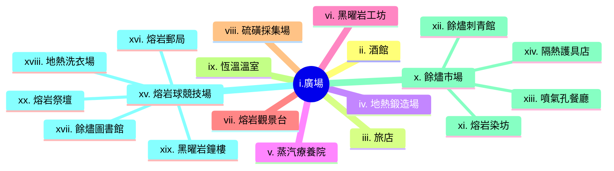

---
tags:
  - 紅流
  - Crimson Flow
  - 城鎮
  - town
---
## I. 紅流 Crimson Flow

建立於地熱活躍區，因地表常年流動的熾熱岩漿景觀而得名。這座城鎮將熱帶島嶼的慵懶風情與火山地帶的險惡環境完美融合。紅流的建築多採用耐熱的黑曜岩與色彩鮮豔的熱帶木材搭建，街道兩旁種植著能在高溫下綻放的火紅花卉。這裡的居民以開朗熱情著稱，他們穿著輕薄且色彩斑斕的絲織品，脖子上常掛著由熔岩冷卻後磨製成的黑色珠串。

不同於一般的工業城鎮，紅流利用地熱溫泉發展出了獨特的觀光與療癒產業。城鎮中心遍布著冒泡的泥漿溫泉與天然的蒸氣浴場，吸引了無數冒險者前來洗去旅途的疲憊。

## II. 地點

### i.廣場
這是城鎮的熱力中心，地面由暗紅色的火山岩磚鋪就，即便在深夜也散發著微弱的餘溫。廣場中央矗立著一座不斷噴發細小岩漿沫的天然熔岩噴泉，被加固的黑曜岩圍欄保護著，是居民集會與慶典的核心舞台。

### ii.酒館
這家名為「熔岩之息」的酒館坐落於廣場一角，建築的一半嵌入了溫暖的岩壁中。店內不供應冰冷的飲料，取而代之的是各種利用地熱釀造、口感辛辣且帶有硫磺香氣的烈酒。

#### a. 內部環境
酒館內部沒有傳統的壁爐，而是透過地板下的天然熱管維持溫度。吧台由整塊拋光的黑曜岩製成，後方的酒架上擺滿了火紅色的琉璃瓶。每當夜幕降臨，店內會點燃特製的熔岩燈，散發出溫暖而迷幻的橘紅光芒。這裡的座椅多鋪有柔軟的耐火獸皮，讓客人在高溫環境下也能感到舒適。

#### b. NPCs

| 項目 | 內容 |
| --- | --- |
| **名稱** | 弗雷 (Frey)|
| **性別** | 男性 |
| **年齡** | 38歲 |
| **種族** | 矮人 |
| **身分** | 酒館老闆 |
| **外觀** | 鬍鬚被編成長辮，末端繫著熔岩球飾品 |
| **個性** | 豪邁大方，喜歡與客人打賭喝烈酒 |
| **備註** | 曾是著名的火山探險家，對地底地形瞭若指掌 |

### iii.旅店
旅店提供紅流最頂級的住宿體驗。這裡最受歡迎的是與天然溫泉相連的客房，房客可以直接從床邊走入冒著熱氣的礦物浴池。

#### a. 內部環境
旅店走廊鋪著厚實的熱帶植物纖維地毯，牆上掛著描繪火山噴發壯麗景象的壁畫。房間內通風極佳，利用巧妙的氣流設計將火山灰隔絕在外，同時引入帶有花香的暖風。每間客房都配備了由黑曜岩打造的恆溫浴缸，水溫始終保持在讓人放鬆的攝氏42度。

### iv. 地熱鍛造場
這座工坊直接跨建在一條穩定的岩漿支流上，工匠們利用導流管將熔岩引入特製的坩堝。這裡不需要風箱，恆定的高溫讓金屬始終保持在最佳的鍛造狀態，出產的武器帶有獨特的火紋。

### v. 蒸汽療養院
紅流最著名的醫療機構，利用富含礦物質的火山泥與特定溫度的地熱蒸汽治療各種慢性疾病與冒險留下的舊傷。療養院建築呈圓拱形，能有效循環內部的藥用蒸汽。

### vi. 黑曜岩工坊
專門加工火山噴發後冷卻形成的天然玻璃。工匠們精巧地將黑曜岩切割成鋒利的手術刀、華麗的飾品或是能折射地熱光的特殊燈具，是城鎮主要的出口貿易品。

### vii. 熔岩觀景台
位於城鎮最高處的懸崖邊緣，地板由強化玻璃與耐熱鋼架組成。遊客可以俯瞰下方如河流般緩慢流動的岩漿，感受大地脈動的震撼視覺效果。

### viii. 硫磺採集場
位於城鎮外圍的黃色結晶區，空氣中瀰漫著刺鼻的氣味。工人們穿著厚重的防護服，採集用於製作火藥、藥劑與染料的高純度硫磺塊。

### ix. 恆溫溫室
利用地熱維持環境溫度的巨大玻璃建築，種植著許多原本只生長在極南之地的熱帶水果與香料。這裡的作物生長速度極快，確保了紅流在貧瘠火山區的食物自給。

### x. 餘燼市場
這是一個半露天的貿易區，攤位多由耐火的石材搭建。除了當地的熔岩工藝品，這裡也能買到來自各地的稀有礦石與抗火藥劑，是商隊雲集之地。

### xi. 熔岩染坊
這間染坊利用火山噴發後殘留的特定礦物與高溫泉水，開發出永不褪色的「烈焰染料」。染坊內掛滿了鮮紅、橘黃與深紫色的絲綢，在熱風中飄揚。

### xii. 餘燼刺青館
這是一家極具特色的店鋪，技藝高超的師傅利用加熱過的黑曜岩針，將混合了微量熔岩灰的顏料刺入皮膚。據說這種刺青在體溫升高時會發出微弱的紅光。

### xiii. 噴氣孔餐廳
這家餐廳沒有廚房，所有的餐點都直接放在天然的地熱噴氣孔上蒸煮。招牌菜是「硫磺燻肉」與「岩漿蛋」，保留了食材最原始的鮮甜與獨特的礦物香氣。

### xiv. 隔熱護具店
專門販售由耐火獸皮與石棉纖維編織而成的冒險裝備。無論是想進入火山口探險，還是單純想在紅流長住，這裡的隔熱靴與防護斗篷都是必備品。

### xv. 熔岩球競技場
這是一個圓形的下沉式建築，底部鋪滿了發熱的沙子。居民們在此進行一種名為「熔岩球」的傳統運動，參賽者需在不直接接觸球體的情況下，利用特製的木拍將球擊入對方球門。

### xvi. 熔岩郵局
這座建築的外牆由耐高溫的紅磚砌成，專門處理與外界的書信往來。由於紅流地熱環境特殊，這裡的信件多使用特製的耐熱羊皮紙，並由訓練有素的「火翼信使鳥」負責運送。

### xvii. 餘燼圖書館
這是一座半地下的石造建築，內部收藏了大量關於地質學、火山活動以及古代耐火文明的文獻。為了防止高溫損壞紙張，館內設有精巧的水冷循環系統，是城鎮中最涼爽的地方。

### xviii. 地熱洗衣場
位於溫泉區下游的公共設施，利用天然的高溫泉水與富含礦物質的泥漿進行衣物清洗。這裡不僅是清潔衣物的地方，也是鎮上婦女們交換日常八卦的重要場所。

### xix. 黑曜岩鐘樓
這座高聳的塔樓完全由黑曜岩砌成，每到整點，守鐘人會敲擊巨大的金屬鐘，沉重的鐘聲能穿透火山區特有的硫磺霧氣，指引迷失在郊外的旅人。

### xx. 熔岩祭壇
位於城鎮邊緣的一處天然平台，正對著活躍的火山口。居民們會在此放置一些不具價值的祭品，祈求火山神靈的平靜，避免毀滅性的噴發。

## III. 有趣的事實

## IV. 冒險鉤子

### i. 佈告欄

### ii. 傳聞

#### a. 真實的傳聞

#### b. 半真半假的傳聞

#### c. 假的傳聞

### iii. 居民請求

## V. 勢力

### 瑪格瑪家族

參見：[[002.瑪格瑪|瑪格瑪家族]]

## VI. 周遭地點

1. [[002.紅流外的火龍巢穴|火龍巢穴]]