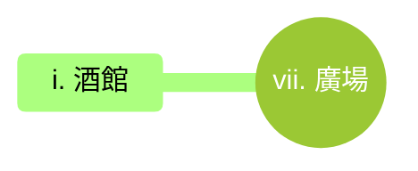

---
tags:
  - 劍貝港
  - Sabershell
  - 村莊
  - village
---
# 劍貝港 Sabershell

## I. 簡介

## II. 地點

## III. 有趣的事實

## IV. 冒險鉤子

### i. 佈告欄

### ii. 傳聞

#### a. 真實的傳聞

#### b. 半真半假的傳聞

#### c. 假的傳聞

### iii. 居民請求

## V. 勢力

## VI. 表格

### a. 基本資訊

| 項目 | 內容 |
| --- | --- |
| **市鎮名稱** |  |
| **地理位置** |  |
| **行政級別** |  |
| **人口規模** |  |
| **主要種族** |  |

### b. 地理與環境

| 項目 | 內容 |
| --- | --- |
| **地形地貌** |  |
| **氣候特徵** |  |
| **周邊資源** |  |
| **交通樞紐** |  |

### c. 政治與經濟

| 項目 | 內容 |
| --- | --- |
| **統治者/組織** |  |
| **法律與治安** |  |
| **主要產業** |  |
| **流通貨幣** |  |
| **進出口貿易** |  |

### d. 文化與生活

| 項目 | 內容 |
| --- | --- |
| **宗教信仰** |  |
| **風俗習慣** |  |
| **特色建築** |  |
| **飲食文化** |  |
| **節慶活動** |  |

### e. 歷史與現況

| 項目 | 內容 |
| --- | --- |
| **建城歷史** |  |
| **重大事件** |  |
| **當前困境** |  |
| **市鎮秘密** |  |

## VII. 周遭地點