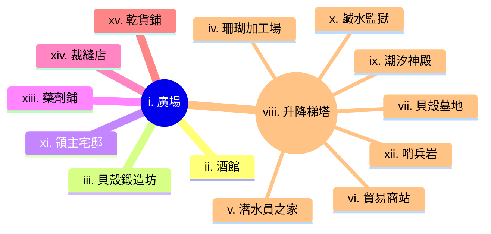

---
tags:
  - 劍貝港
  - Sabershell
  - 村莊
  - village
---
# 劍貝港 Sabershell

## I. 簡介

掌握獨特的海洋鍛造技術，利用高硬度貝殼與珊瑚殘骸打造軍用器械。這座港口村莊坐落於險峻的懸崖之下，以出產極其堅硬的「劍齒巨貝」聞名。不同於傳統的鐵匠鋪，劍貝港的工坊終日迴盪著研磨貝殼的尖銳聲響與冷卻珊瑚礁的嘶嘶聲。這裡的建築多半直接嵌入岩壁，外牆鑲嵌著閃爍的貝殼碎片以抵禦強烈的海風。

劍貝港的武裝力量配備著色澤如珍珠般華麗卻鋒利如鋼鐵的甲冑與兵刃，這使得他們在沿海地區擁有極高的軍事地位。儘管貿易繁榮，但採集深海巨貝的過程充滿危險，不僅要面對洶湧的暗流，更要應對守護貝床的兇猛海獸。

## II. 地點

### i.廣場
這是村莊的社交與貿易中心，地面鋪滿了細碎的貝殼沙，在陽光下反射著微光。廣場中央有一座由巨大鯨魚肋骨搭建而成的涼亭，供村民休憩與交換情報。

### ii.酒館
這家店鋪是劍貝港唯一的娛樂場所。酒館的一面牆壁直接就是天然的岩壁，粗獷的裝修風格與這裡的硬派民風相得益彰。

### iii. 貝殼鍛造坊
這是村莊的核心，空氣中瀰漫著研磨鈣質產生的白色粉塵。巨大的水車帶動著沉重的磨石，將堅硬的劍齒巨貝邊緣磨製成足以切開鋼鐵的利刃。

### iv. 珊瑚加工場
專門處理從深海採集回來的「鋼骨珊瑚」。工匠們利用特殊的酸性溶液軟化珊瑚，將其塑造成符合人體工學的護甲形狀，待其重新硬化後，防禦力不亞於精鋼。

### v. 潛水員之家
這是一棟靠近岸邊的長屋，供負責採集貝殼的潛水員居住與休息。屋內掛滿了特製的配重帶、魚叉以及用來抵禦深海寒冷的厚重皮衣。

### vi. 貿易商站
位於懸崖邊緣，設有大型的吊車系統，直接將貨物從下方的碼頭吊運至村莊。這裡主要處理與外界的軍事訂單，戒備森嚴。

### vii. 貝殼墓地
位於村莊一角的露天區域，堆放著無數失去光澤、破損的巨大貝殼。村民相信這些貝殼仍殘留著海洋的靈魂，禁止外人隨意觸碰。

### viii. 升降梯塔
這是連接懸崖頂端村莊與下方碼頭的唯一通道。巨大的木製平台由粗壯的鯨皮纜繩懸吊，依靠水力配重系統運作。每次升降都會發出沉重的木材摩擦聲，是村莊的生命線。

### ix. 潮汐神殿
一座半嵌入岩壁的小型神殿，祭壇上供奉著一具完整的、長達五公尺的劍齒巨貝王殼。潛水員在出海採集前，都會來此塗抹特製的魚油，祈求不被深海的海獸發現。

### x. 鹹水監獄
位於懸崖最底部的天然洞穴，漲潮時海水會淹沒至囚犯的胸口。這裡專門關押試圖偷竊貝殼鍛造技術的間諜或鬧事的商船水手，環境極其惡劣。

### xi. 領主宅邸
村長兼首席鍛造大師的居所，建築外牆完全由打磨光滑的珍珠母貝鑲嵌而成，在陽光下閃耀著令人眩目的七彩光芒。宅邸內部展示著歷代最強大的貝殼兵器。

### xii. 哨兵岩
位於港口入口處的一座孤立礁石，上面建有小型石塔。駐守的衛兵配備著強力的貝殼弩砲，足以擊穿靠近的掠奪者船隻。

### xiii. 藥劑鋪
這間店鋪位於領主宅邸附近，專門出售由貝殼粉末與深海植物調配而成的藥劑。店內裝潢精緻，空氣中帶著淡淡的清涼薄荷味。

#### a. 內部環境
藥劑鋪的櫃檯由一整塊巨大的白色珊瑚雕琢而成，後方的藥架上整齊排列著五顏六色的玻璃瓶。這裡最著名的產品是「貝殼粉止血劑」，能迅速讓傷口結痂並硬化，提供額外的防禦。

#### b. NPCs

| 項目 | 內容 |
| --- | --- |
| **名稱** | 賽琳娜 (Selina)|
| **性別** | 女性 |
| **年齡** | 29歲 |
| **種族** | 人類 |
| **身分** | 煉金術士 |
| **外觀** | 穿著潔白的長袍，手指常因藥劑染色 |
| **個性** | 冷靜、對醫學有近乎瘋狂的執著 |
| **備註** | 正在研究如何利用貝殼粉修復骨折 |

### xiv. 裁縫店
這家店鋪專門製作適合海上作業的耐磨衣物，以及利用貝殼碎片裝飾的華麗禮服。

#### a. 內部環境
店內掛滿了用魚皮與厚帆布製成的防水外套，角落裡幾位學徒正忙著用細小的貝殼鑽孔，將其縫製在布料上。這裡的衣服不僅耐穿，更因為其獨特的海洋風格深受外地貴族喜愛。

#### b. NPCs

| 項目 | 內容 |
| --- | --- |
| **名稱** | 莫里斯 (Maurice)|
| **性別** | 男性 |
| **年齡** | 45歲 |
| **種族** | 人類 |
| **身分** | 裁縫師 |
| **外觀** | 戴著精緻的單片眼鏡，說話帶有異國口音 |
| **個性** | 追求完美、對時尚有獨到見解 |
| **備註** | 曾經為王室設計禮服，因捲入宮廷醜聞而逃亡至此 |

### xv. 乾貨鋪
這家店鋪位於碼頭附近，專門收購並販售各種深海食材與脫水海產，是船員們補給的首選。

#### a. 內部環境
天花板上掛滿了風乾的魚乾與成串的海帶，空氣中瀰漫著濃郁的鹹腥味。櫃檯後方擺放著數個巨大的木桶，裡面裝滿了用鹽醃漬的貝肉與發酵的海苔醬。

#### b. NPCs

| 項目 | 內容 |
| --- | --- |
| **名稱** | 貝拉 (Bella)|
| **性別** | 女性 |
| **年齡** | 52歲 |
| **種族** | 人類 |
| **身分** | 店主 |
| **外觀** | 穿著深藍色的圍裙，腰間掛著一大串鑰匙 |
| **個性** | 精明能幹，對價格斤斤計較 |
| **備註** | 據說她知道每一艘進港船隻的秘密

## III. 有趣的事實
- **貝殼的鳴響**：在強風吹過懸崖時，嵌入建築外牆的貝殼碎片會產生共振，發出一種低沉且神祕的嗡鳴聲，當地人稱之為「海神的低語」。
- **珍珠母貝的防禦**：領主宅邸的珍珠母貝牆面不僅是裝飾，其特殊的反射結構能有效分散強光的照射，甚至在海戰中能干擾敵方遠程武器的瞄準。
- **珊瑚的記憶**：工匠們相信「鋼骨珊瑚」具有記憶，如果加工時溫度控制不當，珊瑚會試圖恢復成原始的生長形狀，導致護甲變形。
- **禁忌的深海區**：潛水員之間流傳著一個禁忌，絕不在血月之夜下水採集，因為那時劍齒巨貝會張開殼口，誘捕任何靠近的靈魂。
- **貝殼粉的妙用**：除了醫療與鍛造，極細的貝殼粉末也被當地女性當作化妝品使用，能讓皮膚在陽光下呈現出如珍珠般的自然光澤。

## IV. 冒險鉤子

### i. 佈告欄

### ii. 傳聞

#### a. 真實的傳聞
- **劍齒巨貝的共鳴**：這種巨貝的殼確實能感應到遠處海獸的活動，當大型掠食者靠近時，鍛造坊內的未加工貝殼會發出細微的顫動。
- **鋼骨珊瑚的硬化過程**：這種珊瑚在接觸到特定比例的酸性溶液後，其分子結構會發生劇烈變化，硬度在短時間內能超越生鐵，但重量僅有其三分之一。
- **鹹水監獄的秘密通道**：監獄最深處的岩壁確實存在一個被海水侵蝕出的狹窄縫隙，通往懸崖內部的天然溶洞，那是早期走私者使用的路徑。

#### b. 半真半假的傳聞
- **貝殼墓地的靈魂**：傳聞破損的貝殼殘留靈魂，實際上是貝殼內殘留的磷質在潮濕空氣中產生的磷火現象，但當地人確實曾在那裡目擊過不明的人影。
- **藥劑鋪的長生藥**：賽琳娜正在研發的並非長生不老藥，而是一種能極大程度延緩細胞老化的貝殼萃取液，但副作用是會讓使用者的皮膚逐漸硬化如甲殼。
- **領主宅邸的無敵兵器**：傳說宅邸內藏有能斬斷海龍的貝殼劍，實際上那是一把由古代巨獸牙齒與劍齒巨貝融合鍛造的儀式用劍，威力強大但極難操控。

#### c. 假的傳聞
- **升降梯塔的黃金配重**：有傳言說升降梯的配重塊內部灌滿了黃金，這只是為了吸引盜賊進入陷阱的謠言，配重塊其實只是實心的鉛塊與廢棄鐵礦。
- **潮汐神殿的活貝王**：神殿供奉的王殼被傳言在深夜會自行開合吞噬祭品，那只是因為神殿結構導致的風壓變化，使得巨大的貝殼產生位移聲響。

### iii. 居民請求

## V. 勢力

### 摩根家族

參見：[[001.摩根|摩根家族]]

## VI. 周遭地點